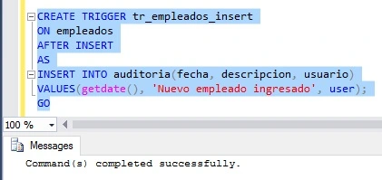
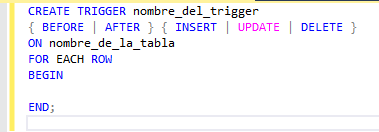
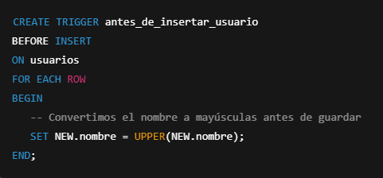
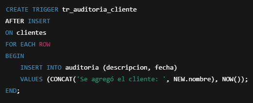
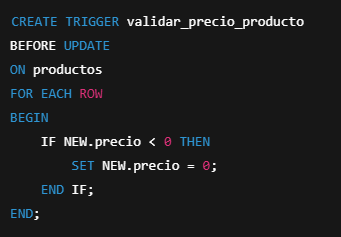
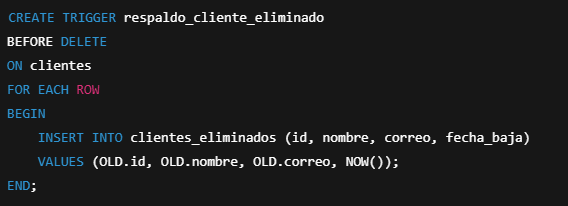
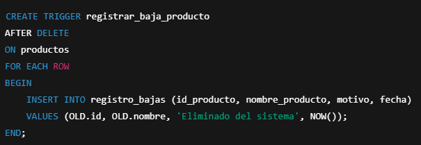
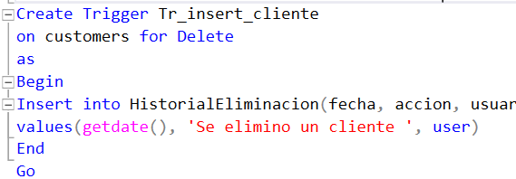
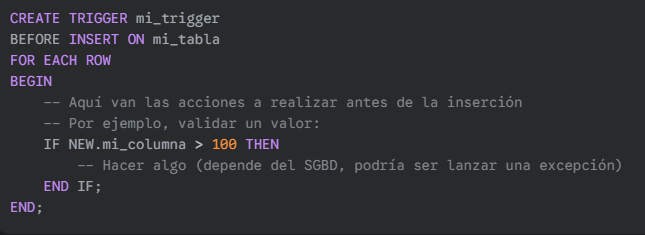
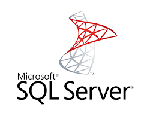

 

**Alunma: Yorka Munchuli**

**Profesor: Víctor Recio**

**Curso: 5to A de informática**

**Materia: Base de Datos**

**Fecha: 29/5/2025**

#

# 📋Conceptos de Trigger en una BD

  ### **1-¿Qué es un Trigger?**
  
Es un procedimiento almacenado que se ejecuta automáticamente en respuesta a ciertos eventos que ocurren en la base de datos. Estos eventos suelen ser operaciones de manipulación de datos (DML) como *INSERT, UPDATE o DELETE* en una tabla o vista.
  
### ✔️ Ejemplo:

### **2-¿Para que sirve un Trigger?**

La principal función de los trigger es contribuir a **mejorar la gestión de la base de datos**. Gracias a ellos muchas operaciones se pueden realizar de forma automática, sin necesidad de intervención humana, lo que permite ahorrar mucho tiempo.

Otra de sus funciones es **aumentar la seguridad e integridad de la información**. Esto lo consiguen gracias a la programación de restricciones o requerimientos de verificación que permiten minimizar los errores y sincronizar la información.

Por otra parte, entre sus principales ventajas es que todas estas funciones se pueden realizar desde la propia base de datos, es decir, **no es necesario recurrir a lenguajes externos de programación.**

### **3-¿Cuándo se puede usar un Trigger?**

Los trigger se puede ejecutar cuando el usuario realizar alguna acción relacionada con **añadir, actualizar o eliminar** información de una tabla. Es decir, al usar los comandos INSERT, UPDATE o DELETE.

Por tanto, para poder usar un trigger es necesario que el usuario posea permisos INSERT y DELETE a la base de datos.

### **4-Estructura de un Trigger.**

### 🔎 Explicacion del codigo: 

**CREATE TRIGGER nombre_del_trigger**: Crea el trigger y le asigna un nombre.

**{BEFORE | AFTER}**: Define si el trigger se ejecuta antes (BEFORE) o después (AFTER) del evento.

**{INSERT | UPDATE | DELETE}**: Especifica el tipo de evento que lo activará.

**ON nombre_de_la_tabla**: Indica sobre qué tabla se aplicará el trigger.

**FOR EACH ROW**: Indica que se ejecuta una vez por cada fila afectada.

**BEGIN ... END;**: Dentro va el bloque de código SQL que quieres que se ejecute.

### **5-Tipos de Trigger**

<li>BEFORE INSERT</li>

 
<li>AFTER INSERT</li>

 
<li>BEFORE UPDATE</li>
 
<li>AFTER UPDATE</li>
 
<li>BEFORE DELETE</li>
 
<li>AFTER DELETE</li>

### **6-¿Cuándo ejecuta su accion un Trigger?**

*BEFORE INSERT:*

Se ejecuta **antes de que una nueva fila** sea insertada en la tabla.

**✔️ Uso típico:**

<li> Validar los datos que se van a insertar.</li>
 
<li> Modificar los valores de las columnas antes de la inserción (por ejemplo, establecer un valor por defecto si no se proporciona, o generar un ID).</li>
 
<li> Prevenir la inserción si no se cumplen ciertas condiciones.</li>
 

*AFTER INSERT:*

Se ejecuta después de que una nueva fila ha sido insertada exitosamente en la tabla.

**✔️ Uso típico:**

<li>Auditar la inserción (registrar la nueva fila en una tabla de logs).</li>
 
<li>Actualizar otras tablas relacionadas basándose en la fila insertada.</li>
 

<li>Enviar notificaciones de que se ha creado un nuevo registro.</li>

 

*BEFORE UPDATE:*

Se ejecuta **antes** de que una o más filas sean actualizadas en la tabla.

**✔️ Uso típico:**

<li>Validar los nuevos valores de las columnas.</li>
 
<li>Modificar los nuevos valores antes de la actualización (por ejemplo, actualizar una fecha de modificación).</li>
 
<li>Prevenir la actualización si no se cumplen ciertas condiciones.</li>
 
<li>Comparar los valores antiguos y nuevos para tomar decisiones.</li>
 

*AFTER UPDATE:*

Se ejecuta **después de que una o más filas** han sido actualizadas exitosamente en la tabla.

**✔️ Uso típico:**

<li>Auditar la actualización (registrar los valores antiguos y nuevos de las columnas modificadas).</li>
 

<li>Actualizar otras tablas relacionadas basándose en los cambios.</li>
 

<li>Invalidar cachés.</li>
 

*BEFORE DELETE:*

Se ejecuta antes de que una o más filas sean eliminadas de la tabla.

**✔️ Uso típico:**

<li>Validar si la eliminación está permitida bajo ciertas condiciones (por ejemplo, verificar si la fila tiene registros relacionados).</li>
 

<li>Realizar acciones antes de la eliminación (por ejemplo, archivar la fila en otra tabla en lugar de eliminarla directamente).</li>
 
<li>Prevenir la eliminación si no se cumplen ciertas condiciones.</li>
 

*AFTER DELETE:*

Se ejecuta **después de que una o más filas han sido eliminadas exitosamente de la tabla.

**✔️ Uso típico:**

<li>Auditar la eliminación (registrar qué filas fueron eliminadas).</li>
 
<li>Actualizar otras tablas relacionadas (por ejemplo, decrementar un contador de registros relacionados).</li>
 

### *7-Ejemplo de un Trigger**

### **8-Trigger Marketing**
Es una técnica que automatiza mensajes a clientes en función de sus acciones o comportamientos, como una compra, una visita a un sitio web o una fecha específica.

### *9-¿Cómo hacer un Trigger?**
## 🗒️ Pasos:
1. **Definir el objetivo del trigger:** Antes de escribir cualquier código, se debe **tener claro qué se quiere lograr con el trigger**. ¿Qué evento debe dispararlo? ¿Qué acciones debe realizar? ¿Debe ejecutarse antes o después del evento? ¿A nivel de fila o de sentencia?
   
2. **Determinar la tabla y el evento:** Identifica la tabla sobre la cual se quiere crear el trigger y el evento específico *(INSERT, UPDATE, DELETE)* que lo activará. También considerar si se quiere que el trigger se **active antes (BEFORE) o después (AFTER) del evento.**
        
### ✔️ Para el codigo:

3. **Escribir la sentencia CREATE TRIGGER:** Utiliza la sintaxis específica de la BD para crear el trigger. Esto generalmente incluye:

<li> La palabra clave CREATE TRIGGER (y posiblemente OR REPLACE).</li>
 

<li>Un nombre único para el trigger.</li>
  
<li>El momento de ejecución (BEFORE o AFTER).</li>
 
<li>El evento (INSERT, UPDATE, DELETE, o combinaciones).</li>
 
<li>La cláusula ON seguida del nombre de la tabla.</li>
 
<li>Opcionalmente, FOR EACH ROW si quieres un trigger a nivel de fila.</li>
 

4. **Definir el cuerpo del trigger:** 
   
   Dentro de un bloque *BEGIN ... END;*, se escribe las sentencias SQL que se ejecutarán cuando el trigger se active. Esto puede incluir:

<li>Consultas SELECT para verificar condiciones.</li>
 
<li>Sentencias INSERT, UPDATE, DELETE para modificar datos en la misma u otras tablas.</li>
 
<li>Uso de las pseudo-tablas OLD y NEW (si el SGBD las soporta y son relevantes para el evento).</li>
 
<li>Lógica condicional (IF ... THEN ... END IF;).</li>
 
<li>Manejo de errores (dependiendo del SGBD).</li>
 

5. **Finalmente guardar o ejecutar la sentencia CREATE TRIGGER:**

 Una vez que hayas escrito el código del trigger, se debe ejecutar esa sentencia en tu cliente de base de datos (por ejemplo, SQL Developer, pgAdmin, MySQL Workbench). Esto creará el trigger en la base de datos.
 ### 🔎 Se visualiza:
 

### **10- Caracteristicas de un Trigger**

Un trigger es un procedimiento almacenado asociado a una tabla que se ejecuta automáticamente en respuesta a un evento específico, como una operación de manipulación de datos (DML) como INSERT, UPDATE o DELETE. 

Almacenados dentro de la base de datos, los triggers **se activan de manera implícita cuando ocurre el evento definido**, permitiendo la ejecución de acciones complejas a nivel de fila o de sentencia. Estas acciones pueden incluir validación de datos, auditoría, y la modificación de información en la misma u otras tablas, a menudo de forma transparente para el usuario que desencadena el evento.

 La capacidad de ejecutarse antes o después del evento disparador les confiere versatilidad para **implementar diversas lógicas de integridad** y gestión dentro del sistema de base de datos.

### **11-Desventajas de un Trigger**
**🗒️ Dentro de las que mas se destacan:**

**✔️ Sobrecarga del servidor:** Los triggers se ejecutan automáticamente con la operación que los dispara. Si los triggers son complejos o realizan muchas operaciones, pueden añadir una sobrecarga significativa al servidor de la base de datos, afectando el rendimiento de las operaciones DML.

**✔️ Dificultad en el mantenimiento:** Los triggers son "invisibles" para las aplicaciones que interactúan con la base de datos. Un comportamiento inesperado o un error en la aplicación podría ser causado por un trigger del que el desarrollador de la aplicación no está al tanto, lo que dificulta la depuración y el mantenimiento.

**✔️ Complejidad del diseño:** El uso excesivo o inapropiado de triggers puede hacer que el diseño de la base de datos sea más complejo y difícil de entender. La lógica de negocio se dispersa entre las tablas (en forma de triggers) en lugar de estar centralizada en la capa de la aplicación.

### **12-Sustituto de los trigguer en otras bases de datos.**
1. **Sistemas NoSQL (ej., MongoDB, Couchbase):**

En muchos sistemas NoSQL, la lógica que se implementaría con triggers en un RDBMS se suele manejar en la capa de la aplicación. Esto proporciona más control y visibilidad sobre la lógica de negocio.
Algunos sistemas NoSQL ofrecen funcionalidades para observar cambios en los datos, como los Change Streams en MongoDB. Estos permiten a las aplicaciones reaccionar en tiempo real a las inserciones, actualizaciones y eliminaciones, de manera similar a un trigger AFTER, pero la lógica de la acción se define en la aplicación.

**2. PostgreSQL:**

PostgreSQL también tiene triggers, que son bastante potentes y similares en concepto a los de otros RDBMS. Sin embargo, PostgreSQL también ofrece características como Reglas (RULES), que pueden modificar o rechazar comandos SQL basándose en ciertas condiciones. Las reglas son más enfocadas en la manipulación de consultas que en la reacción a la modificación de datos en sí.

**3. SQL Server:**

Además de los triggers tradicionales, SQL Server tiene INSTEAD OF triggers. Estos se ejecutan en lugar de la acción DML que los activó, permitiendo una manipulación más fina de cómo se realizan las modificaciones (por ejemplo, actualizar una vista que involucra varias tablas).

**4. Bases de datos orientadas a grafos (ej., Neo4j):**

En bases de datos de grafos, la lógica reactiva a cambios en los nodos o relaciones a menudo se maneja a través de extensiones o procedimientos almacenados que se invocan directamente desde la aplicación cuando se realizan modificaciones. No hay un concepto directo equivalente a los triggers que se activen automáticamente en el mismo sentido que en los RDBMS.

**5. Sistemas de colas de mensajes (ej., RabbitMQ, Kafka):**

Aunque no son bases de datos en sí, los sistemas de colas de mensajes permiten una arquitectura donde una acción (similar a un evento de base de datos) puede publicar un mensaje a una cola, y múltiples servicios (que serían análogos a la lógica de un trigger) pueden consumir ese mensaje y realizar acciones. Esto desacopla la acción original de las reacciones.

